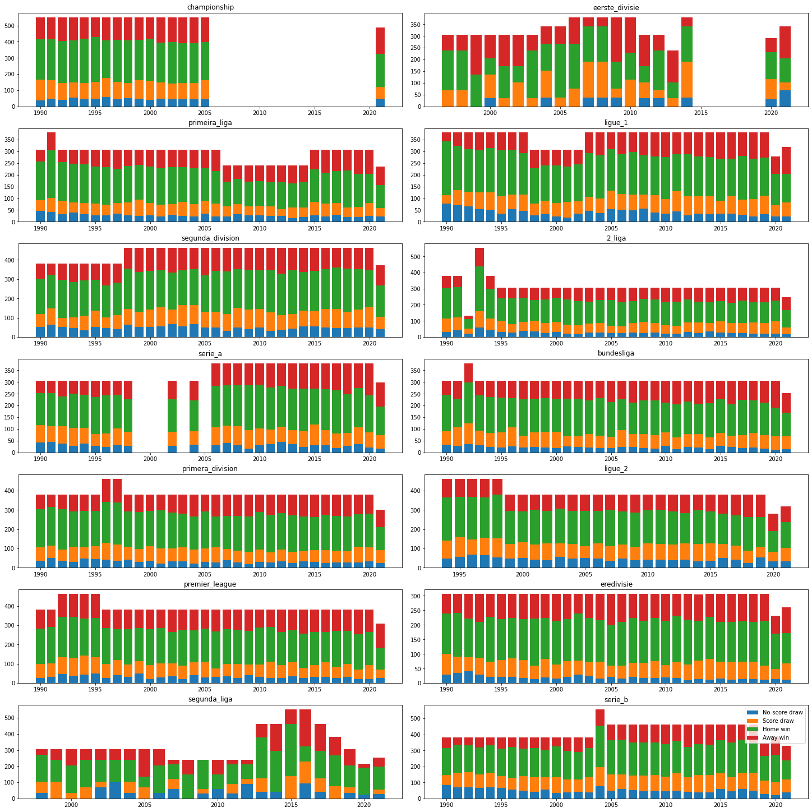
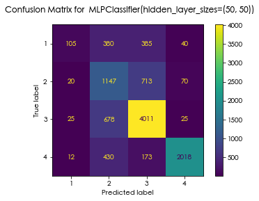

# Football Prediction project

This is a project to build a model based on results of football matches in various leagues since 1990, to be used to predict the results of future matches. It will use various ML-focused python packages, including these: pandas, seaborn ...

## Milestone 1: EDA and Data Cleaning

- Data was supplied in a zip file, `Football-Dataset-zip`
- I used a regex to extract the season from the filename: `year_match = re.compile('(\d{4})')` to include the season in the data
- Also created two functions, `goals` which gave home and away goals as `int`s from a `str` scoreline, and `outcome` which gave a numerical category to each result, either 1 (no-score draw), 2 (score draw), 3 (home win) or 4 (away win)
- Then created `league_list`, a dataframe listing all the leagues with their league name, the folder name, and a list of all the csv files contained in the folder
- Loop through that df and construct a master dataframe pulling together all the data from the separate files per league and per season. All data that was imported had column names turned to lower case with `df.columns = df.columns.str.lower()`
- Add columns for home / away / total goals and outcome, using the functions defined earlier
- Then graphed the outcomes per league per season:

This just gives an overview of the kind of spread of data, the seasons we have in different leagues, any change over time, etc.

###

Some general findings:

- there were no results given for certain leagues in certain seasons
- the number of teams in a particular league was not consistent throughout all seasons
- the patterns of outcomes and total goals across the different leagues does not generally differ much, although there are some that are slightly more consistent across the seasons, and a couple (notably Segunda Liga and Eerste Divisie) which are much more variable)

### Hypotheses as to which factors might be significant

1. capacity - some teams might play better at large stadia
1. pitch surface
1. which round ... some teams might be better earlier or later in the season?
1. how about newly-promoted? (we would need to engineer this feature later on)

## Calculating win/loss streaks

This turned out to be a thorny problem. Various attempts by myself and others to use elegant `groupby`-style methods just didn't work. And it can be pretty hard to debug those with all the pandas alchemy going on behind the scenes.

Instead I took a rather less elegant approach:
1. create a new zero-filled column for each team, named as the team name
1. for each match, if either team won, put a 1 in their column and a -1 in the losing team's column
1. loop through each season and each team, and for each case create streak data on that subframe; `concat` all those together
1. for each row, copy the team's streak info into either the `home_streak` or the `away_streak` column, depending on where they are playing
1. use `groupby('link').sum()` to combine the matching pairs of rows - there'll be two for each match, one for the home team and one away
1. `merge` this resulting frame back into the main dataframe

Checks of subframes for a particular season and team suggest that it's working nicely.

## Joining datasets

Several datasets required joining based on team names - constructing the `link` which could then be used as a common key. But the team names were far from identical - in fact there were significant differences. First I attempted to use `difflib.get_close_matches`; this gave reasonably good results, but there were several teams that failed to match properly. I then discovered a library called [fuzzywuzzy](https://pypi.org/project/fuzzywuzzy/) which implements Levenshtein Distance, and turned out to deliver superb matching results. Once I had corrected for Manchester (from "Man.") it seems to be flawless (although I haven't done an exhaustive check).

#### Potential improvements:
1. track draws as well rather than effectively ignoring them
1. check that we're accurate on the streak being about games completed **prior** to the game in hand - not sure whether this is right yet.

## Milestone 2: Feature Engineering

Feature engineering is the work to develop new or calculated information about each of the datapoints. The aim is to give more dimensions of data for a model to learn from. It's not that more is necessarily better, but by having more options to choose from you are more likely to be able to find the few features that will drive a strongly-performing model.

The [Elo rating](http://clubelo.com/System) for each team as at the point of each match taking place was supplied as a [pickle](https://pythonnumericalmethods.berkeley.edu/notebooks/chapter11.03-Pickle-Files.html) file. This was unpickled and then joined onto the match result dataframe.

In addition to the streaks described above, I added the following features:
- cumulative F/A goals at home and away
- is the team newly promoted or relegated this season?

Then finally I performed some very basic normalisation, changing the season (year) to be the number of years before 2022, and the capacity to be in tens of thousands.

The pipeline was set up assuming that the provided files were already downloaded to the local directory. I simply took the actions in the cells of the notebook and brought them together into a python script, adding some console logging, including progress bars using `tqdm`. (Note: there's a 5-10 minute chunk at the end which doesn't log or show progress - I should address this otherwise it looks like the script has hung.)

The pipeline script outputs a CSV file `cleaned_dataset.csv`.

## Milestone 3: Upload the data to the database

I created an RDS instance in AWS, ensuring that the security group in use allowed access on the PostgreSQL port 5432 from my IP address. I used `psycopg2` to connect to the database, and then created an `sqlalchemy` engine. This enables a ridiculously easy way to push data from a `pandas` `dataframe` up to the database table, just by calling `df.to_sql`. Using the `if_exists='replace'` parameter means that any repeat data (sharing the same match link, which is set as our primary key) will be overwritten rather than duplicated.

It's not clear to me though _why_ we were uploading the data to RDS, since it doesn't seem to have any further role in the project. 🤷🏻‍♂️

## Milestone 4: Model training

Early model training was pretty good, hitting around 70% from the start. Everything I tried subsequently either yielded a similar score, or lower. The coefficients from the Lasso model show that the most important features are the streaks, plus the cumulative goals for/against. Interestingly, the Elo coefficients are a fair bit lower, with Home Elo even being pushed to zero (although I retained it in the model).

Disappointingly, the feature of being newly-promoted or -relegated didn't seem to be useful.

In the end, I used the following features:
- Elo home/away
- Cumulative goals F/A / home/away
- Winning/losing streak home/away

I then ran GridSearchCV and RandomSearchCV for each of a number of possible classifiers. Many of these seemed to overfit, and it was difficult to see how to use the GridSearch to check this: the scoring options only seemed to work on the training data, and not additionally on evaluation data, meaning that I could end up with a 99%+ accuracy score but a horribly overfitted model. I ended up having to work quite manually to figure out which hyperparameters were behind this problem, and restrict my searches accordingly.

For example, in the KNN classifier, setting `weights='distance'` resulted in gross over-fitting, so rather than including this hyperparameter in the search, I just fixed it to `uniform` and solely explored the `n_neighbors` parameter.

Having tuned the hyperparameters to get the optimal version of each classifier, I then trained each of these models in turn and evaluated their performance using the separate validation dataset (which had not been used when tuning the hyperparameters, and thus was unseen by these models so far). I showed the training and validation accuracies, together with a confusion matrix.

By far the weakest performance of all the models was in predicting a draw, whether score or no-score. This is something we could perhaps improve; one idea is to extend the streak feature so that a streak of draws shows up differently from no streak at all (both of them currently showing as zero).

The model is then saved using `sklearn`'s `joblib` (as filename `football_classifier.pkl`).

## Milestone 5: Inference

I started by looking for a decent source of data - and found a downloadable Excel spreadsheet at [football-data.co.uk](https://football-data.co.uk). This gives exactly what's needed: a list of results in the season so far, league by league. Together with the Elo data from [clubelo.com](http://clubelo.com/API) I pulled together the relevant data points for any pair of teams at the current point in the season.

However, I then noticed that the Elo data from `clubelo.com` was completely different from that supplied in the original datasets. So instead I have changed this to pick that data up via the scraper which Iván shared, which gets data from [besoccer.com](https://besoccer.com).

Predictions for this weekend's games (16/4/22) are rather odd, because the long winning streaks of Man City and Liverpool have been wiped out by their drawn game against each other on 10/4/22. It might be worth looking at ways to migitate against that kind of thing? Easiest way would be to add a new feature of a rolling net number of wins in the last 5 games (or something like that).

#### How it works:

The python script `prep_prediction_data.py` scrapes the necessary data as described here, and creates a `.csv` file `cleaned_results.csv` which contains the features needed to predict scores of the next round of matches. The league being considered is currently hard-coded in this script.

The notebook `model_results.ipynb` pulls in both the trained model (from `football_classifier.pkl`) and the cleaned feature data on upcoming matches (`cleaned_results.csv`) to predict the next round of matches in all leagues.

## Reflections and possible improvements

1. As discussed above, the model under-predicts draws. Adding in specific features about draw streaks might help here, as might including some kind of rolling "last n games net results", summing up 1 for a win, -1 for a defeat and 0 for a draw over the past n games.

1. Rather than using the initial data we were supplied with from `besoccer.com`, it might have been better to use data from `football-data.co.uk`, which is what I used for the prediction features. This just could have been easier to work with, and covers a slightly different, but wider, set of European leagues. Elo data would still have had to be added, but again there is an alternative source at `clubelo.com`, which in fact includes some very useful metrics.

1. It's unclear why the score of the predictor is quite so good (~70%). The main features driving the accuracy seem to be the win/loss streaks. It might be interesting to dive further into those data and see if there is any more accuracy to be won by creating different variations on the streak metric.